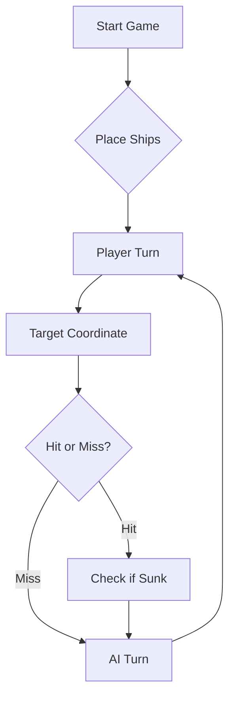

# ⚓ Battleship 2.0


> A modern take on the classic naval warfare game, designed for the XVII century setting with updated software engineering patterns.

---

## 📖 Table of Contents
- [Link do Youtube](#-link-do-youtube)
- [Project Overview](#-project-overview)
- [Key Features](#-key-features)
- [Technical Stack](#-technical-stack)
- [Installation & Setup](#-installation--setup)
- [Code Architecture](#-code-architecture)
- [Roadmap](#-roadmap)
- [Contributing](#-contributing)
- [Notas do Grupo](#notas-do-grupo)

---

## 🔗 Link do Youtube
Nesta secção encontra-se o link referente ao vídeo de Youtube que demonstra as funcionalidades implementadas pelo grupo.

- Link: https://youtu.be/YwOjc6ZX_Ao

---

## 🎯 Project Overview
This project serves as a template and reference for students learning **Object-Oriented Programming (OOP)** and **Software Quality**. It simulates a battleship environment where players must strategically place ships and sink the enemy fleet.

### 🎮 The Rules
The game is played on a grid (typically 10x10). The coordinate system is defined as:

$$(x, y) \in \{0, \dots, 9\} \times \{0, \dots, 9\}$$

Hits are calculated based on the intersection of the shot vector and the ship's bounding box.

---

## ✨ Key Features
| Feature | Description | Status |
| :--- | :--- | :---: |
| **Grid System** | Flexible $N \times N$ board generation. | ✅ |
| **Ship Varieties** | Galleons, Frigates, and Brigantines (XVII Century theme). | ✅ |
| **AI Opponent** | Heuristic-based targeting system. | 🚧 |
| **Network Play** | Socket-based multiplayer. | ❌ |

---

## 🛠 Technical Stack
* **Language:** Java 17
* **Build Tool:** Maven / Gradle
* **Testing:** JUnit 5
* **Logging:** Log4j2

---

## 🚀 Installation & Setup

### Prerequisites
* JDK 17 or higher
* Git

### Step-by-Step
1. **Clone the repository:**
   ```bash
   git clone [https://github.com/britoeabreu/Battleship2.git](https://github.com/britoeabreu/Battleship2.git)
   ```
2. **Navigate to directory:**
   ```bash
   cd Battleship2
   ```
3. **Compile and Run:**
   ```bash
   javac Main.java && java Main
   ```

---

## 📚 Documentation

You can access the generated Javadoc here:

👉 [Battleship2 API Documentation](https://britoeabreu.github.io/Battleship2/)


### Core Logic
```java
public class Ship {
    private String name;
    private int size;
    private boolean isSunk;

    // TODO: Implement damage logic
    public void hit() {
        // Implementation here
    }
}
```

### Design Patterns Used:
- **Strategy Pattern:** For different AI difficulty levels.
- **Observer Pattern:** To update the UI when a ship is hit.
</details>

### Logic Flow


---

## 🗺 Roadmap
- [x] Basic grid implementation
- [x] Ship placement validation
- [ ] Add sound effects (SFX)
- [ ] Implement "Fog of War" mechanic
- [ ] **Multiplayer Integration** (High Priority)

---

## 🧪 Testing
We use high-coverage unit testing to ensure game stability. Run tests using:
```bash
mvn test
```

> [!TIP]
> Use the `-Dtest=ClassName` flag to run specific test suites during development.

---

## 🤝 Contributing
Contributions are what make the open-source community such an amazing place to learn, inspire, and create.

1. Fork the Project
2. Create your Feature Branch (`git checkout -b feature/AmazingFeature`)
3. Commit your Changes (`git commit -m 'Add some AmazingFeature'`)
4. Push to the Branch (`git push origin feature/AmazingFeature`)
5. Open a **Pull Request**

---

## Notas do Grupo

### Contas Alternativas
Alguns dos membros do grupo têm outras contas de GitHub anteriores à UC de ES. Isto gerou o problema de que alguns commits ficam inadvertidamente associados a essas contas em vez das criadas para a UC. Nesse sentido identificam-se abaixo as contas e o aluno associado:

- [ IGE-123025, Username Conta Alternativa: jcjesus45 ]
- [ IGE-123011, Username Conta Alternativa: Reynolds2005 ]


### Prompt final proposto ao LLM
Aqui encontra-se o prompt final que o grupo apresentou ao LLM e que o levou a realizar um jogo completo com sucesso.

> Considere agora a seguinte tática de geração de rajadas de tiros.
> • Crie um Diário de Bordo com o registo de cada rajada disparada, numerando-as sequencialmente (Rajada 1, 2, 3...). Guarde as coordenadas exatas de cada tiro e o
> respetivo resultado (Água, Nau atingida, Barca afundada, etc.). A memória é a principal arma de um bom estratega.
> • Não dispare fora dos limites do mapa (ex: Z99) nem repita tiros em coordenadas já testadas. A única exceção para este desperdício de pólvora é a última rajada do
> jogo, apenas para perfazer os 3 tiros obrigatórios quando a frota inimiga já estiver irremediavelmente no fundo do mar.
> • Se atingir um navio numa rajada, dispare nas posições contíguas (Norte, Sul, Este, Oeste) na jogada seguinte para descobrir a orientação da embarcação e acabar de a
> afundar. No entanto, se a rajada anterior confirmar que o navio já foi afundado, não dispare para as posições contíguas, pois os navios nunca estão encostados.
> • Como as Caravelas, Naus e Fragatas são linhas retas, um tiro certeiro significa que o resto do navio está na horizontal ou na vertical. Como os navios não se podem tocar
> (nem sequer nos cantos), as posições diagonais a um tiro certeiro são garantidamente água (a única exceção é o corpo do Galeão, devido à sua forma em T). Evitar estas
> diagonais poupa imensos tiros.
> • Quando o relatório de uma rajada confirmar que um navio foi afundado (ex: Fragata de 4 posições), analise os dados do seu Diário de Bordo para identificar exatamente   > onde caíram esses 4 tiros. Confirmada a posição exata da carcaça, marque todas as quadrículas adjacentes (o halo de 1 posição em redor do navio) como água
> intransitável. É impossível haver outra embarcação nesse perímetro.
> • Se a sua frota for toda afundada, declare a derrota com honra. Em contrapartida, seja um vencedor magnânimo se for o inimigo a render-se com os navios todos no fundo
> do oceano!


---

## 📄 License
Distributed under the MIT License. See `LICENSE` for more information.

---
**Maintained by:** [@britoeabreu](https://github.com/britoeabreu)  
*Created for the Software Engineering students at ISCTE-IUL.*
